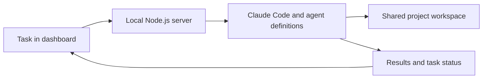

# CircleCare Agents

**An AI team I built to help run my pet healthcare startup.**

Building CircleCare means switching between market research, engineering, veterinary questions, and day-to-day operations. I built this internal agent system to give those recurring workflows a shared home—and let me delegate work through a local dashboard.

## Meet the team

| Agent | Focus |
| --- | --- |
| Maggie | Strategy, business decisions, and pitch feedback |
| Ryan | Market research, competitor analysis, and evidence gathering |
| Evan | Engineering and prototype development |
| Vivi | Veterinary research and medical-content questions for professional review |
| Amy | Meeting notes, action items, and project coordination |

These are AI agent roles, not human team members or licensed professionals.

## What I built

- **A local team dashboard:** choose agents, enter a task, and track progress.
- **Task dispatch:** a Node.js server sends requests to Claude Code, using project-specific agent definitions.
- **Execution history:** view task status, result summaries, and reported cost.
- **Shared context:** agent instructions and a common workspace connect research, decisions, and follow-up work.
- **Roundtable requests:** ask the team to examine a question from multiple perspectives.

## How it works

## Example workflow

An illustrative task: ask Ryan to research a pet-care problem, Vivi to identify clinical questions that need a veterinarian's review, and Evan to explore a prototype. Ask Amy to turn the findings into follow-up actions, with Maggie providing strategic feedback.

## Current status

This is an internal, local prototype. The dashboard and dispatch implementation exist; this public showcase documents their design. It is not a hosted service or a claim of autonomous clinical decision-making.

Company context, meeting notes, agent outputs, execution records, and credentials are excluded from this showcase. No performance or time-saving metrics are claimed without measurement.

## Why I built it

I wanted to spend less time repeatedly setting up the same kinds of tasks and more time turning research into decisions and prototypes. The system gives each workflow a clear role while keeping me involved in reviewing the work.
