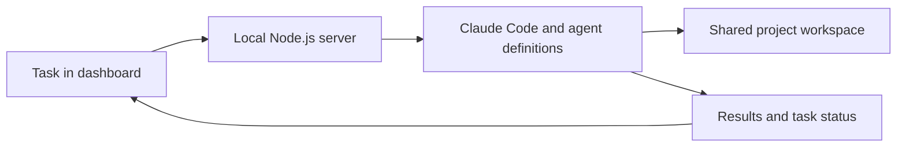

# CircleCare Team

**An AI team I built to help run my pet healthcare startup.**

Building CircleCare means switching between market research, engineering, veterinary questions, and day-to-day operations. I built this internal agent system to give those recurring workflows a shared home—and let me delegate work through a local dashboard.

## Meet the team

| Agent | Focus |
| --- | --- |
| Maggie | Strategy, business decisions, and pitch feedback |
| Ryan | Market research, competitor analysis, and evidence gathering |
| Evan | Engineering and prototype development |
| Vivi | Veterinary research and medical-content questions for professional review |
| Amy | Meeting notes, action items, and project coordination |

These are AI agent roles, not human team members or licensed professionals.

## What I built

- **A local team dashboard:** choose agents, enter a task, and track progress.
- **Task dispatch:** a Node.js server sends requests to Claude Code, using project-specific agent definitions.
- **Execution history:** view task status, result summaries, and reported cost.
- **Shared context:** agent instructions and a common workspace connect research, decisions, and follow-up work.
- **Roundtable requests:** ask the team to examine a question from multiple perspectives.

## How it works



## Example workflow

An illustrative task: ask Ryan to research a pet-care problem, Vivi to identify clinical questions that need a veterinarian's review, and Evan to explore a prototype. Ask Amy to turn the findings into follow-up actions, with Maggie providing strategic feedback.

## Current status

This repository contains a runnable public edition of my internal dashboard: the original interface and dispatch implementation adapted for a standalone checkout, sample data, and public agent definitions. It is a local prototype, not a hosted service.

Company context, meeting notes, agent outputs, execution records, and credentials are excluded from this repository. No performance or time-saving metrics are claimed without measurement.

## Why I built it

I wanted to spend less time repeatedly setting up the same kinds of tasks and more time turning research into decisions and prototypes. The system gives each workflow a clear role while keeping me involved in reviewing the work.

## Run the dashboard

Requires Node.js 20 or newer. There are no npm dependencies to install.

```sh
git clone https://github.com/joannalai55/circlecare-team.git
cd circlecare-team
npm start
```

Open **http://127.0.0.1:4317**. The default is preview mode: explore the dashboard and sample data without running AI tasks. Live dispatch remains disabled until explicitly enabled.

## Run real agent tasks

Install and authenticate the official [Claude Code CLI](https://code.claude.com/docs/en/overview) separately. Confirm `claude --version` works, stop the preview server, then run:

```sh
ENABLE_DISPATCH=1 npm start
```

Select an agent, enter a task, and click the dispatch button. Roundtable requests ask Claude Code to use all five subagents and synthesize their perspectives; the dashboard does not implement a separate multi-agent scheduler.

**Execution permissions:** live mode uses your Claude account and `acceptEdits` permission mode. Tasks can edit files in this checkout and may incur usage charges. Use a separate project copy and review outputs. This server binds to loopback only and is not intended for public hosting.

Optional configuration:
- `PORT`: local server port (default `4317`).
- `CLAUDE_BIN`: Claude executable path (default `claude`).
- Copy `team/shared/team-context.example.md` to `team/shared/team-context.md` to provide your own private context.

## Repository map

| Path | Purpose |
| --- | --- |
| `team/dashboard.html` | Dashboard interface |
| `team/server.js` | Local API and Claude Code dispatch |
| `team/dashboard-data.example.json` | Public sample data |
| `.claude/agents/` | Five public agent definitions |
| `CLAUDE.md` | Shared project instructions |
| `.runtime/` | Generated local state and execution history; excluded from Git |

The public edition removes internal Drive references and records. It also replaces broad file serving with a dashboard-only route, checks request origins, and keeps real dispatch opt-in. Automatic inbox schedules and messaging integrations are not included.

## Verification

```sh
npm test
```

Tests exercise the local API, preview mode, request validation, and dispatch using a fake CLI. They do not call a paid model. Real Claude execution requires your authenticated local setup and has not been verified by these tests.
